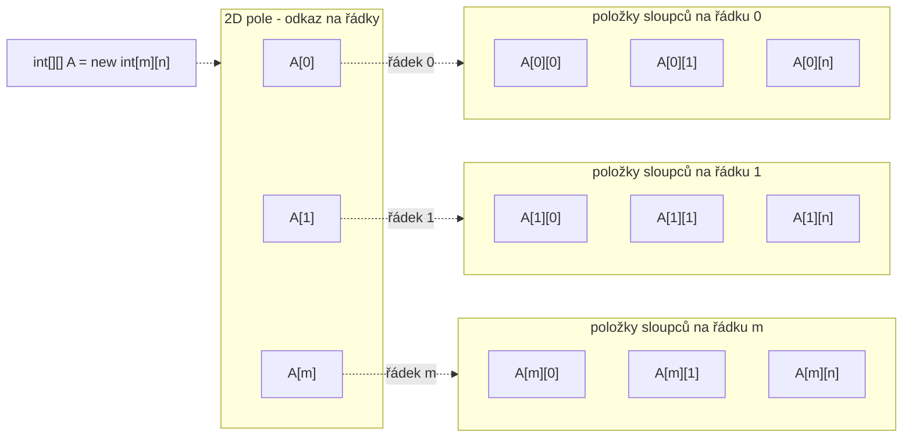

# Úlohy - 2D Pole

- [Úlohy - 2D Pole](#úlohy---2d-pole)
  - [Najednou je těch polí více!](#najednou-je-těch-polí-více)
  - [2D pole jako matice](#2d-pole-jako-matice)
  - [Print 2D pole](#print-2d-pole)
  - [Load 2D pole](#load-2d-pole)
  - [Sečti dvě matice](#sečti-dvě-matice)
  - [Norma matice](#norma-matice)
  - [Stochastická matice](#stochastická-matice)
  - [Symetrická matice](#symetrická-matice)

## Najednou je těch polí více!

> [!question] 
- Jaký je index prvku?
- Jak zjistím počet řádků/sloupců?
- Jak zjistím poslední prvek v poli?

> [!examples]
> - `array` - pole odkazů na pole
> - `array[0]` - pole
> - `array[0][0]` - prvek pole na indexu 0 v poli na indexu 0


## 2D pole jako matice

> [!question] Jak projít maticí (M*M):
- Jak projít jen diagonálou? (Z předu, od zadu)
- Nad diagonálou?
- Pod diagonálou?
- Vertikálně do půlky?
- Horizontálně do půlky?

## Print 2D pole

Vytiskněte 2D pole na obrazovku ve formátu matice.

```java
System.out.format("%5.2f ", number);
```

```java
double[][] test1 = {
    {1, -12, 3},
    {5, 4, 1}};
System.out.println("Test print");
print(test1);
```

## Load 2D pole

Načtětě pole od uživatele.

```java
Scanner sc = new Scanner(System.in);
System.out.println("Zadej rozmery matice: ");
System.out.println("Zadej hodnoty matice: ");
```

```java
System.out.println("Test load");
double[][] loaded = load();
print(loaded);
```

## Sečti dvě matice

Naprogramujte funkci `sum`, která sečte dvě matice **stejného** rozměru a vrátí výslednou matici.

$$
C = A + B
$$

$$
C_{i,j} = A_{i,j} + B_{i,j}
$$

```java
throw new IllegalArgumentException("Size of matrices do not match");
```

```java
double[][] test2 = {
    {1, 1, 1},
    {1, 1, 1}};
System.out.println("Test sum");
print(sum(test1, test2));
```

## Norma matice

$$
\forall i,j: |A'_{i,j}| \leq 1
$$

> [!tip]
> Normovaná matice má pouze takové prvky, které nabývají hodnot mezi **-1** a **1**.

$$
A' = \frac{A}{max(|A|)}
$$

Napište funkci, která normuje matici.

`normalize`

```java
System.out.println("Test norm");
print(normalize(test1));
```

## Stochastická matice

$$
\forall i,j: A_{i,j} \neq 0
$$

$$
\forall i: \sum_{j=0}^{m} A_{i,j} = 1
$$

> [!tip]
> Stochastická matice je taková, která má všechny hodnoty **nenulové**, a **suma** na každém řádku je rovna **1**.

Napište funkci, která ověří, zda je matice stochastická.

`isStochastic`

```java
System.out.println("Test stochastic");
double[][] test3 = {
    {0.5, 0, 0.5},
    {0.2, 0.4, 0.4}};
System.out.println(isStochastic(test3)); //true
```

## Symetrická matice

$$
A = A^T
$$

neboli:

$$
\forall i,j: A_{i,j} = A_{j,i}
$$

Napište funkci, která ověří, zda je matice symetrická podle hlavní diagonály.

`isSymetricbyMainDiagonal`

```java
System.out.println("Test symetric");
double [][] test4 = {
    {1, 5, 3},
    {5, 7, 3},
    {3, 3, 5}};
System.out.println(isSymetricbyMainDiagonal(test4)); //true
```